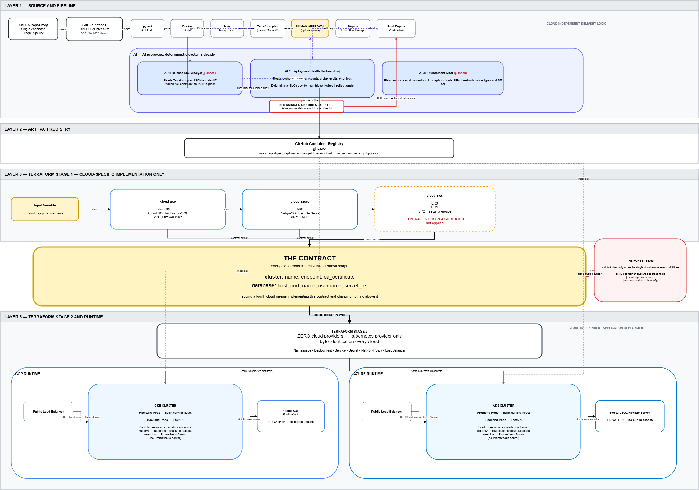
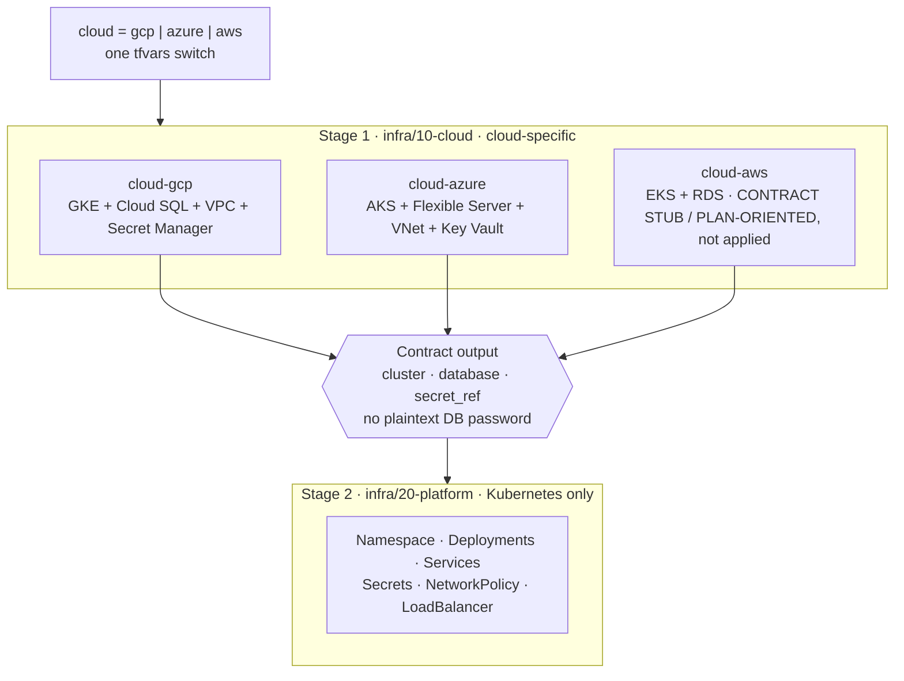

# Idea Board Platform

Outmarket DevOps case study: a small Idea Board app deployed through **cloud-agnostic Terraform** and an **AI-assisted CI/CD** path, live on **GCP (GKE)** and **Azure (AKS)**.

| Cloud | Public demo (HTTP) |
| --- | --- |
| **GCP** | http://34.14.209.195/ |
| **Azure** | http://4.224.236.191/ |

> Demo load balancers are **HTTP-only** for this case study (no TLS certs). Treat URLs as temporary demo endpoints.

**Thesis for AI steps:** *AI proposes; deterministic systems decide.* The Health Sentinel never lets a model choose shell commands — hard readiness rules decide rollback; the LLM only writes the incident summary when an API key is present.

---

## 1. High-level architecture



*Figure: Idea Board on a shared Stage 2 platform; GCP / Azure / AWS modules plug in via the same contract. CI builds to GHCR; the Health Sentinel watches post-deploy health.*

Source (editable): [`docs/architecture.drawio`](docs/architecture.drawio) — open in [diagrams.net](https://app.diagrams.net/). After edits, **File → Export as → PNG** and replace `docs/architecture.png`.



**Why two Terraform stages?** A Kubernetes provider cannot reliably be configured from cluster credentials created in the *same* apply. Splitting also limits blast radius: cloud substrate (`10-cloud`) vs workloads (`20-platform`).

**Application stack**

| Tier | Tech |
| --- | --- |
| Frontend | React + Vite, nginx in production (`/api` proxied to backend) |
| Backend | FastAPI, SQLAlchemy, Alembic |
| Data | PostgreSQL (`ideas`: id, content, created_at) |
| Images | Single registry: `ghcr.io/jeyapaul1990/...` (both clusters pull the same tags) |

**Health model (on purpose)**

| Endpoint | Role |
| --- | --- |
| `/healthz` | Liveness — process up; **no** DB |
| `/readyz` | Readiness — DB reachable (or forced fail via `FORCE_READINESS_FAIL`) |
| `/metrics` | Prometheus **text format** scrape endpoint (no Prometheus server in this demo) |

That split avoids cascading restarts when the database blips, and gives the Health Sentinel real signals.

**Security notes**

- Stage 1 stores DB passwords in Secret Manager / Key Vault and exposes only `secret_ref` in the contract.
- Passwords are resolved at Stage 2 apply time (`scripts/resolve-db-password.sh`) and injected into a Kubernetes Secret — not written into Stage 1 outputs as plaintext.
- The one cloud-aware seam for cluster login is `scripts/kubeconfig.sh` (`gcloud` / `az` / `aws`).

More deploy detail: **[infra/README.md](infra/README.md)**.

---

## 2. Run locally (Docker Compose)

**Prerequisites:** Docker Desktop (or Docker Engine + Compose v2).

```bash
git clone https://github.com/jeyapaul1990/idea-board-platform.git
cd idea-board-platform
docker compose up --build
```

Open **http://localhost:8080**

| Service | Host port |
| --- | --- |
| Frontend | **8080** (proxies `/api/*` → backend) |
| Backend | **8000** |
| Postgres | **5433** → container 5432 |

API smoke test:

```bash
curl http://localhost:8000/healthz
curl http://localhost:8000/readyz
curl -X POST http://localhost:8000/api/ideas -H "Content-Type: application/json" -d "{\"content\":\"hello\"}"
curl http://localhost:8000/api/ideas
```

Optional bad-readiness demo (local only): copy `docker-compose.override.example.yml` → `docker-compose.override.yml` and set `FORCE_READINESS_FAIL=1`.

### Backend tests

```bash
cd apps/backend
pip install -r requirements.txt -r requirements-dev.txt
pytest -q
```

CI runs the same `pytest` job on every push/PR (in-memory SQLite via dependency overrides — no Postgres required in the test job).

---

## 3. Pipeline and cloud deploy

### GitHub Actions (CI/CD)

| Workflow | Trigger | Purpose |
| --- | --- | --- |
| **[CI/CD](.github/workflows/ci.yml)** | push / PR | **pytest** → build images → **Trivy** (CRITICAL) → push GHCR → on **`main`**: deploy to **GKE** (`kubectl set image`) → **Health Sentinel** |
| **[Deploy Health Sentinel](.github/workflows/deploy-health-sentinel.yml)** | `workflow_dispatch` | Manual/demo path (incl. `demo_bad_deploy=true` rollback rehearsal) |

**CD note:** Pushing to `main` rolls new image tags to the live GKE demo namespace, then runs the sentinel (undo on UNHEALTHY). Azure stays on the same images via GHCR; re-apply Stage 2 / `kubectl set image` there when you want AKS refreshed (or extend the workflow with `AZURE_CREDENTIALS`).

Secrets (see **[.github/README.md](.github/README.md)**):

| Secret | Required for |
| --- | --- |
| `GCP_SA_KEY` | GKE deploy job + sentinel |
| `AZURE_CREDENTIALS` | AKS sentinel / optional Azure deploy |
| `GEMINI_API_KEY` | Optional LLM incident prose |

### Deploy cloud substrate (Stage 1)

Separate remote-state prefixes per cloud (`infra/*/backends/*.hcl`) so GCP and Azure never share one state.

```bash
# GCP
cd infra/10-cloud
terraform init -reconfigure -backend-config=backends/gcp.hcl
terraform apply -var-file=../envs/gcp.tfvars

# Azure (set ARM_SUBSCRIPTION_ID in the shell first)
terraform init -reconfigure -backend-config=backends/azure.hcl
terraform apply -var-file=../envs/azure.tfvars
```

### Deploy the app (Stage 2)

```bash
# Point kubectl at the target cluster (see scripts/kubeconfig.sh)
cd infra/20-platform
terraform init -reconfigure -backend-config=backends/gcp.hcl   # or azure.hcl

# Resolve DB password from secret_ref, trim newlines, then apply
# PowerShell example (GCP):
#   $DB_PASS = (gcloud secrets versions access latest --secret=idea-board-demo-db-password --project=idea-board-platform).Trim()
terraform apply -var-file=../envs/platform-gcp.tfvars -var="database_password=$DB_PASS"
```

Frontend Service type is `LoadBalancer` → public IP in `kubectl get svc -n idea-board-demo`.

---

## 4. AI integration

### What shipped (P0): Deployment Health Sentinel

Post-deploy watchdog in `scripts/health_sentinel.py`:

1. **Collect** — Ready replicas, per-pod Ready, restart counts, `/readyz` via `kubectl exec`, recent logs.  
2. **Decide (deterministic)** — hard thresholds (not Ready, unavailableReplicas, failed `/readyz`, etc.).  
3. **Act** — optional `kubectl rollout undo`.  
4. **Explain** — short summary; Gemini/OpenAI only if a key is set. **No LLM → still rolls back.**

**Demo B (rehearsed):** Actions → **Deploy Health Sentinel** → `demo_bad_deploy=true`  
Sets `FORCE_READINESS_FAIL=1`, replaces pods so an old Ready pod cannot mask failure, waits for UNHEALTHY, undoes, resets the flag.

Local equivalent: `scripts/demo-health-sentinel.ps1` (Windows) or `scripts/demo-health-sentinel.sh`.

### Design choices

| Choice | Why |
| --- | --- |
| Deterministic first | Rollback must not depend on model availability or hallucinations |
| Allowlisted action (`rollout undo`) | AI never emits arbitrary shell |
| Graceful degrade | Clone/run without an API key still works |
| Multi-provider client shape | Gemini preferred; OpenAI fallback — same idea as a multi-model gateway |

### Tangible value

A green “apply/push” does not mean users are served. The sentinel closes that gap: **observe real Kubernetes signals → auto-undo bad revisions → leave a human-readable incident note.**

### Planned / stubbed (not required for this demo)

| Feature | Status |
| --- | --- |
| Release Risk Analyst (PR comment on plan + risky Alembic) | Hook files under `apps/backend/demo/`; workflow not required for MVP |
| Environment Sizer (NL → tfvars + policy) | Documented intent only |

---

## 5. Cloud-agnostic approach

**Contract, not copy-paste.** Every cloud module emits the same `contract`. Stage 2 never imports `google` / `azurerm` / `aws` providers — only `kubernetes`.

| Cloud | Role in this repo |
| --- | --- |
| **GCP** | Live — GKE + private Cloud SQL (primary; closest to a GKE-centric production stack) |
| **Azure** | Live — AKS Free tier + PostgreSQL Flexible Server (private VNet) |
| **AWS** | **Contract stub / plan-oriented** — module present for the same contract; **not applied** (EKS control-plane cost). Stays plan/validate-clean, not a second paid cluster |

**Switching clouds:** change `cloud = "gcp" | "azure" | "aws"` in tfvars, use the matching backend prefix, fetch kubeconfig via `scripts/kubeconfig.sh`, apply Stage 2 with the same manifests.

**Pipeline design:** one GHCR image stream for all clouds; cloud-specific bits are auth to the cluster (`GCP_SA_KEY` / `AZURE_CREDENTIALS`), not separate Dockerfiles.

---

## API reference

| Method | Path | Description |
| --- | --- | --- |
| GET | `/api/ideas` | List ideas |
| POST | `/api/ideas` | Body: `{"content":"..."}` |
| GET | `/healthz` | Liveness |
| GET | `/readyz` | Readiness (DB) |
| GET | `/metrics` | Prometheus text format (no Prometheus server) |

---

## Repository layout

```
apps/backend/                 FastAPI + Alembic + pytest
apps/frontend/                React + nginx
infra/10-cloud/               Stage 1 cloud modules + backends/
infra/20-platform/            Stage 2 Kubernetes
infra/envs/                   gcp / azure / aws / platform tfvars
scripts/                      kubeconfig, resolve-db-password, health_sentinel
docs/                         architecture.png, architecture.drawio
.github/workflows/            CI/CD (test, Trivy, deploy) + Health Sentinel demo
docker-compose.yml
```

---

## License

Case-study submission code; use at your own risk for demos only.
